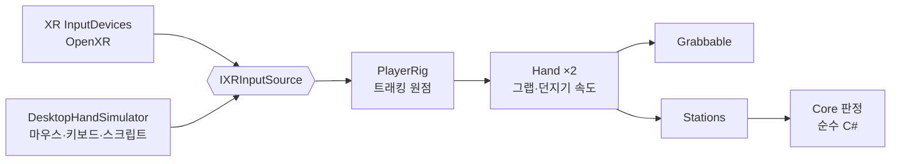

# unity-xr-interaction-lab


-brightgreen)
-brightgreen)


**툴킷 없이 직접 구현한 VR 상호작용 랩** — 손 입력·그랩·소켓 장착, 손 속도 타격 판정, 방패 막기, 카트리지 슬롯독, 짚라인, VR 안 그립 정렬, 던지기 + 제출 슬롯.

라이브 VR 멀티플레이 게임 개발 중 해결한 문제를 회사 코드 없이 범용으로 다시 구현했습니다.

**이 저장소는 기능 데모가 아니라 코드 샘플입니다.** 판정 규칙은 전부 UnityEngine 참조가 없는 C# 어셈블리에 있고, 101개 EditMode 테스트가 동작을 고정합니다. 데모 씬은 확인용으로만 두었습니다.

이 저장소는 Claude Code와 함께 작성했습니다. 문제 정의·설계·테스트 시나리오·검증 판정과 최종 결정은 본인이 했고, 구현 초안과 반복 작업은 AI가 보조했습니다. 커밋 이력의 `Co-Authored-By` 트레일러가 그 기록입니다.

## 읽는 순서

코드를 보러 오셨다면 이 순서를 권합니다. 전부 `Packages/com.jongreul.xr-interaction/` 아래에 있습니다.

| # | 파일 | 무엇을 보면 되는지 |
|---|---|---|
| 1 | `Runtime/Core/Strike/StrikeDetector.cs` | 손 속도를 리그 로컬로 재서 "쳤는가"를 판정. 탈것 이동·재시뮬레이션 틱이 끼어도 오탐이 없는 이유 |
| 2 | `Tests/EditMode/Strike/StrikeDetectorTests.cs` | 같은 궤적을 월드 좌표로 판정하면 오탐이 난다는 것까지 단언한 테스트 |
| 3 | `Runtime/Core/Zipline/ZiplineRide.cs` · `ZiplinePath.cs` | 호 길이 경로, 종점 감속 곡선, 손 바꿔 잡기 여유 시간 |
| 4 | `Runtime/Core/Throw/ThrowVelocityEstimator.cs` · `SettleDetector.cs` · `SubmissionBox.cs` | 최소제곱 던지기 속도, "언제 멈췄는가" 판정, 제출 슬롯 규칙 |
| 5 | `Runtime/Core/Equip/SocketSensor.cs` · `EquipState.cs` | 거리 + 소켓 법선 각도로 장착 판정, 슬롯당 1개·교체 확인 상태 |
| 6 | `Runtime/Core/Grip/GripOffset.cs` · `TrackSlider.cs` | 오른손 오프셋 → 왼손 거울상, VR 안 슬라이더 수학 |
| 7 | `Runtime/Core/Shield/ShieldBlock.cs` · `Runtime/Core/Cartridge/CartridgeSlots.cs` | 각도 막기·내구도, 카트리지에 붙어 다니는 쿨타임 |

---

## 이 저장소가 푸는 문제

- **손으로 "쳤는가"는 속도만으로 판정이 안 된다.** 팔목만 튕겨도 빠르고, 옆으로 스쳐도 빠르고, 탈것에 타서 몸이 움직이면 손이 가만히 있어도 월드 속도가 생긴다. 네트워크 재시뮬레이션 틱이 끼면 기준점이 리셋되기도 한다.
- **2D 메뉴 대신 물건을 몸에 대서 입히려면** 소켓 근접 판정이 필요하다. 거리만 보면 등 뒤에서 머리 소켓에 붙는다.
- **방패·슬롯독 같은 물리적 UI**는 각도·거리·쿨타임 규칙이 화면 연출과 섞이기 쉽다. 규칙을 떼어 테스트로 고정해야 튜닝할 때 흔들리지 않는다.
- **짚라인은 손을 케이블에 붙이면 멀미가 난다.** 팔의 흔들림이 곧 시야의 흔들림이 된다. 손을 바꿔 잡는 순간 양손이 비는 한두 프레임에 떨어져서도 안 되고, 처진 케이블 구간에서 멈추거나 종점에 세게 부딪혀서도 안 된다.
- **쥔 도구가 손에 어떻게 맞는지**는 사람이 헤드셋을 쓰고 봐야 정할 수 있다. 헤드셋을 벗고 에디터 창을 만지는 왕복 없이, VR 안에서 코드 수정 없이 맞추고 저장하는 도구가 필요하다.
- **던진 물건은 "언제 멈췄는가"를 누군가 확정해야 한다.** 물리에 맡겨 두면 피어마다 굴러간 자리가 조금씩 달라진다. 제출 상자는 쥔 채 넣었다 빼는 동작, 튕겨 나가는 공, 받지 않는 물건을 구분해 세야 한다.

## 설계

### 툴킷을 쓰지 않은 이유

손·그랩·소켓을 실무에서 직접 짜 온 방식 그대로 재구현했다. 입력은 Unity 내장 XR 입력(`InputDevices`, OpenXR)만 쓰고, 헤드셋이 없을 때는 같은 인터페이스(`IXRInputSource`)의 **데스크톱 손 시뮬레이터**가 들어간다. 판정 규칙은 전부 엔진 비의존 C#으로 떼어 냈다.



### 구성 요소

| 영역 | 클래스 | 책임 |
|---|---|---|
| 입력·리그 | `IXRInputSource` · `XRDeviceInputSource` · `DesktopHandSimulator` · `PlayerRig` | 머리·손 자세와 그립/트리거. 헤드셋 세션이 실제로 돌 때만 실기기, 아니면 시뮬레이터 |
| 그랩 | `Hand` · `Grabbable` · `GripOffsetProfile` | 반경 내 최근접 그랩, 그립 누름/뗌 히스테리시스, 최소제곱 던지기 속도, 손 바꿔 잡기, 도구별 그립 오프셋(오른손 + 거울상 왼손) |
| 장착 (3-1) | `EquipState` · `SocketSensor` · `ShelfLayout` · `ProximityToggle` → `EquipStation` | 슬롯당 1개·교체 확인, 거리 + 소켓 법선 각도, 카테고리 격자 진열, 거리 히스테리시스, 마네킹 미러 |
| 타격 (3-2) | `StrikeDetector` → `StrikeStation` | 리그 로컬 이력 속도, 타격면 법선 기준 안쪽 속도·각도·스트로크, 맨손/도구 임계 분리, 재타격 잠금, 되돌아간 샘플 무시 |
| 방패 (3-3) | `BlockJudge` · `ShieldDurability` · `ShieldBlocker` → `ShieldStation` | ±45° 막기, 우회 공격, 3단계 내구도·파손·수리 |
| 슬롯독 (3-4) | `CartridgeSlots` → `CartridgeStation` | 3칸 꽂기/빼기, 카트리지에 붙는 쿨타임(옮겨 꽂아도 초기화 안 됨), 쿨타임 고리 |
| 짚라인 (3-5) | `ZiplinePath` · `ZiplineRide` → `ZiplineStation` | 호 길이 경로·최근접 투영, 경사·저항으로 정한 속도와 최저/최고 속도, 남은 거리로 만든 종점 감속 곡선, 양손을 놓아도 0.2초 여유(손 바꿔 잡기), 리그를 손이 아니라 손잡이에 고정, 이탈 시 케이블 방향 속도로 낙하·착지 |
| 그립 정렬 (3-6) | `GripOffset` · `TrackSlider` → `GripAlignStation` · `GripTuningWindow`(에디터) | 한 손은 도구, 다른 손은 패널 슬라이더(X·Y·Z·피치·요·롤) — 끄는 즉시 반영, SAVE·REVERT, 저장하지 않고 놓으면 폐기, 오른손 값 → 왼손 거울상. 에디터 창과 같은 프로필 에셋을 쓴다 |
| 던지기 + 제출 (3-8) | `ThrowVelocityEstimator` · `SubmissionBox` · `SettleDetector` → `ThrowStation` | 최근 0.1초 최소제곱 속도, 종류 필터·중복 1회·정원·정해진 수 이상일 때만 제출, 쥔 채 넣는 동안은 세지 않고 놓는 순간 셈, 멈춤(또는 제한 시간) 판정 후 물리를 끄고 고정 |

```
Jongreul.XrInteraction.Core      순수 C# (noEngineReferences, System.Numerics) — 판정 규칙 전부
Jongreul.XrInteraction           Unity 계층 — 입력·리그·손·그랩
Jongreul.XrInteraction.Stations  스테이션(규칙 + 표시)
Jongreul.XrInteraction.Editor    그립 튜닝 창
```

### 설계에서 고른 것

- **짚라인: 리그를 손잡이에 고정** — 손을 케이블에 붙이면(클라이밍 방식) 팔의 추적 잡음이 그대로 시야를 흔든다. 잡는 순간의 리그-손잡이 오프셋을 유지하고, 손은 트래킹대로 둔다.
- **짚라인: 여유 시간으로 손 바꿔 잡기** — 한 손을 떼고 다른 손으로 잡는 사이 양손이 모두 빈 순간이 생긴다. 0.2초 안에 다시 잡으면 속도를 잃지 않는다.
- **짚라인: 최저 속도 + 감속 곡선** — 처진 구간에서 멈추거나 되돌아가지 않게 최저 속도를 두고, 종점 앞에서는 `v² = 도착속도² + 2·감속도·남은거리`를 넘지 않게 한다.
- **그립 정렬: VR 안의 패널** — 에디터 창(Grip Tuning)은 헤드셋을 벗고 봐야 한다. 쥔 느낌은 헤드셋 안에서 정해지므로 같은 프로필을 VR 안 슬라이더로도 고칠 수 있게 했다.
- **던지기: 멈춘 순간 고정** — 멈춤 판정(느린 속도가 0.4초 지속, 또는 5초 제한)이 나면 물리를 끄고 자리를 확정한다. 멀티플레이에서는 이 판정을 서버가 한 번 내리고 결과만 동기화하는 자리다.

## 확인 방법

1. Unity **6000.3.9f1**로 열고 `Assets/Demos/InteractionLab.unity` → Play.
2. 숫자 키 **1–7**로 스테이션 앞으로 이동한다(1 타격 · 2 옷장 · 3 방패 · 4 슬롯독 · 5 짚라인 · 6 그립 정렬 · 7 던지기).
3. 조작(시뮬레이터): 마우스 = 오른손 이동 · **Q**를 누르고 있으면 왼손 · 휠 = 앞뒤 · **R**+마우스 = 손 회전 · 왼쪽 버튼 = 그립 · 방향키 = 시선.
   - **타격**: 손을 들었다가 패드로 빠르게 내리친다 → 게이지가 찬다. 옆으로 스치거나 천천히 누르면 표시판에 거부 이유가 뜬다.
   - **옷장**: 미니어처를 쥐고 머리 위·얼굴 앞으로 가져가면 초록 고리가 뜨고, 놓으면 장착된다. 오른쪽 마네킹이 따라 입는다. 다른 모자를 놓으면 교체 확인이 뜨고, 6초 안에 한 번 더 놓으면 바뀐다.
   - **방패**: 받침대의 방패를 쥐고 몸 앞에 든다. 정면 투사체는 막히고 옆에서 오는 것은 들어온다. 막을수록 초록 → 노랑 → 빨강.
   - **슬롯독**: 카트리지를 쥐고 등 뒤로 가져가 놓으면 꽂힌다. 부스의 USE로 쓰면 슬롯 둘레 점 고리가 비었다가 다시 찬다.
   - **짚라인**: 출발대 위에서 머리 위 주황 손잡이를 쥐면 출발한다. 가는 도중 다른 손으로 쥐면 넘겨받아 계속 가고, 양손을 다 놓으면 떨어진다. 종점에서는 자동으로 놓는다.
   - **그립 정렬**: 받침대의 도구를 한 손에 쥐고, 다른 손으로 왼쪽 패널의 파란 손잡이를 쥐고 끈다 → 손 안의 도구가 바로 따라 돈다. SAVE로 저장, REVERT로 되돌린다. Paddle은 일부러 맞추지 않은 새 도구다.
   - **던지기**: 공을 쥐고 휘두르며 놓으면 날아간다. 앞 상자에 세 개를 넣고 왼쪽 벨을 손으로 치면 제출된다. 회색 상자(잡동사니)는 튕겨 나온다.
4. 그립 튜닝 에디터 창: Play 중 도구를 쥔 채 **Tools › XR Interaction Lab › Grip Tuning** — VR 패널과 같은 프로필(`Assets/Demos/GripProfiles`)을 쓴다.
5. 헤드셋: XR Plug-in Management에서 OpenXR을 켜면 같은 씬이 실기기 입력으로 돈다.

## 검증

| 구분 | 수 | 내용 |
|---|---|---|
| EditMode (Core) | **101** | 타격 14 · 장착 21(상태 8·소켓 7·진열 4·거리 전환 2) · 방패 10 · 카트리지 7 · 짚라인 17(경로 5·탑승 12) · 그립 10(오프셋 5·슬라이더 5) · 던지기 22(속도 6·제출 슬롯 9·정지 7) |
| PlayMode | **37** | 손·그랩 5 · 타격 3 · 옷장 5 · 방패 5 · 슬롯독 4 · 짚라인 4 · 그립 정렬 5 · 던지기 6 — 시뮬레이터로 실제 프레임 루프를 돈다 |

대표 테스트:

- **리그가 움직여도 오탐 없음** — 손은 리그에 대해 가만히 있고 리그만 3 m/s로 내려가 손이 패드에 닿는 상황. 리그 로컬 판정은 명중 0, 같은 궤적을 월드 좌표로 판정하면 명중(오탐)이 난다는 것도 함께 단언한다(EditMode와 PlayMode 양쪽).
- **되돌아간 샘플** — 스트로크 도중 시간이 과거인 샘플(재시뮬레이션 틱)을 끼워 넣어도 무시하고 명중 판정이 유지된다.
- **던지기 속도** — 2 m/s로 휘두르다 놓으면 물체 속도가 2 m/s ± 0.3. 추적 잡음 ±5 mm에서 마지막 두 프레임 차이 대비 오차 20 % 미만.
- **던져 넣기** — 포물선을 역산한 속도로 손을 휘둘러 놓으면 상자에 들어가 세어지고, 멈추면 물리가 꺼져 그 자리에 고정된다. 쥔 채 넣는 동안은 세지 않는다.
- **짚라인 손 바꿔 잡기** — 양손을 놓은 0.1초 사이 다른 손으로 잡으면 속도를 잃지 않는다(EditMode). 실제 왼손으로 넘겨받아 종점까지 가서 착지한다(PlayMode).
- **짚라인 종점 감속** — 45° 급경사에서도 도착 속도 ≤ 0.9 m/s, 모든 틱에서 속도가 감속 곡선 아래에 있다.
- **그립 정렬** — 오른손으로 쥐면 프로필 오프셋, 왼손으로 쥐면 거울상. 다른 손으로 슬라이더를 끌면 쥔 도구 자세가 바로 바뀌고, 저장하지 않고 놓으면 프로필은 그대로다.
- **그립 경계 흔들림** — 쥐는 기준(0.6)과 펴는 기준(0.35) 사이를 오가도 놓치지 않는다.

타격 판정 기준(맨손 1.8 m/s · 도구 1.2 m/s · 각도 50° · 스트로크 0.12 m)과 짚라인 속도(최저 1 · 최고 6 · 도착 0.8 m/s)는 **데모 기준 초기값**이다. 헤드셋 실측 튜닝은 아직 하지 않았고, 인스펙터와 표시판으로 조정한다.

## 한계와 다음 단계

- **헤드셋 실측 전** — 모든 GIF와 테스트는 시뮬레이터 입력이다. 실제 컨트롤러의 추적 잡음·지연에서 판정 기준을 다시 잡아야 한다.
- **남은 스테이션** — 팔 IK(3-7, v2).
- **그랩은 키네매틱 추종** — 잡은 물체가 벽을 통과할 수 있다. 물리 조인트 방식은 다음 단계.
- **짚라인 낙하는 간이 탄도** — 캐릭터 컨트롤러 없이 리그를 직접 옮기고 발밑 가장 높은 바닥에 내려놓는다. 벽 충돌은 없다.
- **정지 고정·제출은 로컬 판정** — 네트워크에서는 상태 권한(서버)이 판정하고 결과를 동기화해야 한다. 이 저장소는 판정 규칙까지만 다룬다.
- **그립 정렬 SAVE가 디스크에 남는 것은 에디터에서 에셋일 때만** — 빌드에서는 실행 중 값만 바뀐다.
- **내 착용물 숨김은 레이어 30**을 쓴다. 프로젝트에서 이미 쓰는 레이어면 `EquipStation.SelfWearableLayer`를 바꾼다.
- **스테이션 조립은 코드** — 씬 diff를 작게 하려고 기본 도형으로 만들었다. 실제 게임에서는 프리팹·아트가 들어갈 자리.

## 관련 포트폴리오

- 포트폴리오(Notion): [강종렬 포트폴리오 2026](https://app.notion.com/p/jongreulk/2026-3d849fd9829281cba738df3134fa9b8a)

---

### English summary

- A VR interaction lab built **without an interaction toolkit**: hand input, grabbing, body-socket equipping, strike detection, shield blocking, cartridge slot dock, zipline, in-headset grip alignment, throwing into a submission slot.
- Rebuilt from scratch as a generic Unity package, based on problems solved while shipping a live multiplayer VR game (no company code).
- Input comes from Unity's built-in XR devices (OpenXR) or a desktop hand simulator behind the same interface, so every demo and test runs without a headset.
- All rules (strike gating in rig space, socket distance + angle, block angle, durability, cartridge cooldowns, zipline speed/brake/hand-swap grace, slider math, submission counting, settle detection, throw velocity) live in an engine-free C# assembly: 101 EditMode + 37 PlayMode tests.
- Open `Assets/Demos/InteractionLab.unity`, press 1–7 to jump between stations.
