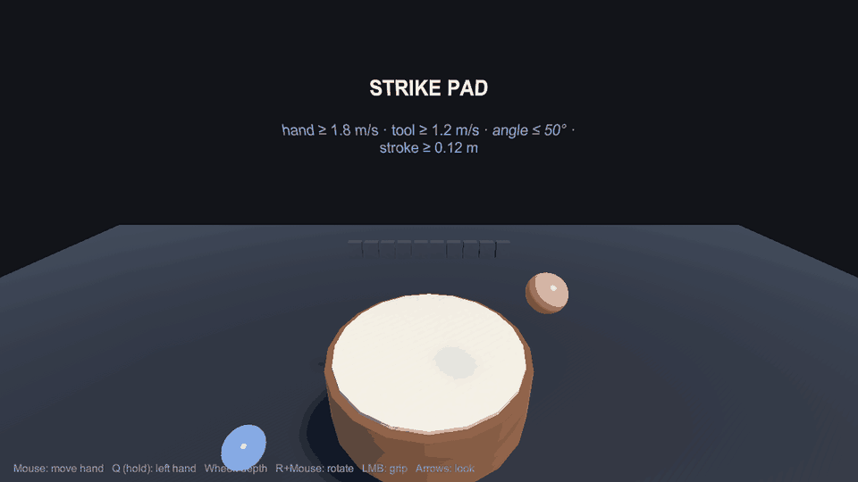
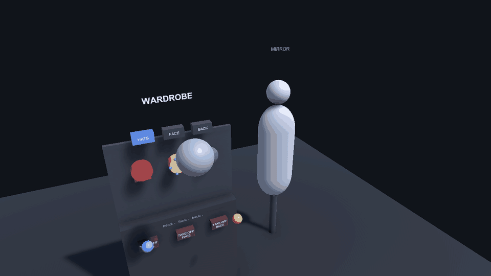
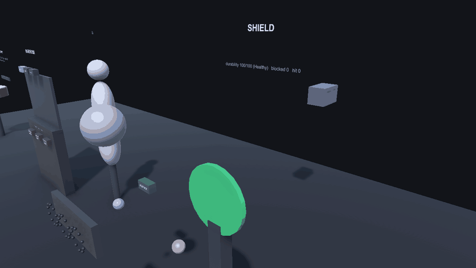
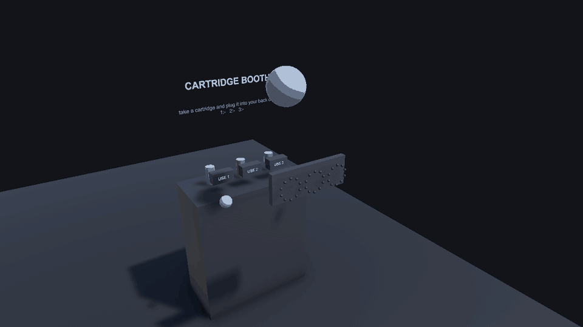
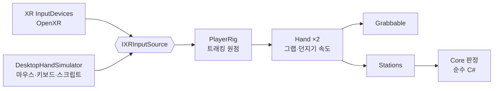

# unity-xr-interaction-lab


**툴킷 없이 직접 구현한 VR 상호작용 랩** — 손 입력·그랩·소켓 장착, 손 속도 타격 판정, 방패 막기, 카트리지 슬롯독.

라이브 VR 멀티플레이 게임 개발 중 해결한 문제를 회사 코드 없이 범용으로 다시 구현했습니다.

| 타격 패드(1인칭) | 장착 옷장 + 마네킹(관찰자 시점) |
|---|---|
|  |  |
| **방패 막기** | **카트리지 슬롯독** |
|  |  |

<sub>헤드셋 없이 데스크톱 손 시뮬레이터로 헤드리스 촬영. 헤드셋 촬영본은 추가 예정.</sub>

---

## 이 저장소가 푸는 문제

- **손으로 "쳤는가"는 속도만으로 판정이 안 된다.** 팔목만 튕겨도 빠르고, 옆으로 스쳐도 빠르고, 탈것에 타서 몸이 움직이면 손이 가만히 있어도 월드 속도가 생긴다. 네트워크 재시뮬레이션 틱이 끼면 기준점이 리셋되기도 한다.
- **2D 메뉴 대신 물건을 몸에 대서 입히려면** 소켓 근접 판정이 필요하다. 거리만 보면 등 뒤에서 머리 소켓에 붙는다.
- **방패·슬롯독 같은 물리적 UI**는 각도·거리·쿨타임 규칙이 화면 연출과 섞이기 쉽다. 규칙을 떼어 테스트로 고정해야 튜닝할 때 흔들리지 않는다.
- **쥔 도구가 손에 어떻게 맞는지**는 사람이 헤드셋을 쓰고 봐야 정할 수 있다. 코드 수정 없이 맞추고 저장하는 도구가 필요하다.

## 설계

### 툴킷을 쓰지 않은 이유

손·그랩·소켓을 실무에서 직접 짜 온 방식 그대로 재구현했다. 입력은 Unity 내장 XR 입력(`InputDevices`, OpenXR)만 쓰고, 헤드셋이 없을 때는 같은 인터페이스(`IXRInputSource`)의 **데스크톱 손 시뮬레이터**가 들어간다. 판정 규칙은 전부 엔진 비의존 C#으로 떼어 냈다.



### 구성 요소

| 영역 | 클래스 | 책임 |
|---|---|---|
| 입력·리그 | `IXRInputSource` · `XRDeviceInputSource` · `DesktopHandSimulator` · `PlayerRig` | 머리·손 자세와 그립/트리거. 헤드셋 세션이 실제로 돌 때만 실기기, 아니면 시뮬레이터 |
| 그랩 | `Hand` · `Grabbable` · `GripOffsetProfile` | 반경 내 최근접 그랩, 그립 누름/뗌 히스테리시스, 최소제곱 던지기 속도, 손 바꿔 잡기, 도구별 그립 오프셋(오른손 + 거울상 왼손) |
| 장착 (3-1) | `EquipState` · `SocketSensor` · `ShelfLayout` · `ProximityToggle` → `EquipStation` | 슬롯당 1개·교체 확인, 거리 + 소켓 법선 각도, 카테고리 격자 진열, 거리 히스테리시스, 마네킹 미러 |
| 타격 (3-2) | `StrikeDetector` → `StrikeStation` | 리그 로컬 이력 속도, 타격면 법선 기준 안쪽 속도·각도·스트로크, 맨손/도구 임계 분리, 재타격 잠금, 되돌아간 샘플 무시 |
| 방패 (3-3) | `BlockJudge` · `ShieldDurability` · `ShieldBlocker` → `ShieldStation` | ±45° 막기, 우회 공격, 3단계 내구도·파손·수리 |
| 슬롯독 (3-4) | `CartridgeSlots` → `CartridgeStation` | 3칸 꽂기/빼기, 카트리지에 붙는 쿨타임(옮겨 꽂아도 초기화 안 됨), 쿨타임 고리 |
| 그립 정렬 (3-6) | `GripOffset` · `GripTuningWindow`(에디터) | 오프셋 적용·역산·거울상, Play 중 슬라이더로 조절하고 바로 저장 |
| 던지기 (3-8) | `ThrowVelocityEstimator` | 최근 0.1초 샘플의 최소제곱 기울기 |

```
Jongreul.XrInteraction.Core      순수 C# (noEngineReferences, System.Numerics) — 판정 규칙 전부
Jongreul.XrInteraction           Unity 계층 — 입력·리그·손·그랩
Jongreul.XrInteraction.Stations  스테이션(규칙 + 표시)
Jongreul.XrInteraction.Editor    그립 튜닝 창
```

## 확인 방법

1. Unity **6000.3.9f1**로 열고 `Assets/Demos/InteractionLab.unity` → Play.
2. 숫자 키 **1–4**로 스테이션 앞으로 이동한다(1 타격 · 2 옷장 · 3 방패 · 4 슬롯독).
3. 조작(시뮬레이터): 마우스 = 오른손 이동 · **Q**를 누르고 있으면 왼손 · 휠 = 앞뒤 · **R**+마우스 = 손 회전 · 왼쪽 버튼 = 그립 · 방향키 = 시선.
   - **타격**: 손을 들었다가 패드로 빠르게 내리친다 → 게이지가 찬다. 옆으로 스치거나 천천히 누르면 표시판에 거부 이유가 뜬다.
   - **옷장**: 미니어처를 쥐고 머리 위·얼굴 앞으로 가져가면 초록 고리가 뜨고, 놓으면 장착된다. 오른쪽 마네킹이 따라 입는다. 다른 모자를 놓으면 교체 확인이 뜨고, 6초 안에 한 번 더 놓으면 바뀐다.
   - **방패**: 받침대의 방패를 쥐고 몸 앞에 든다. 정면 투사체는 막히고 옆에서 오는 것은 들어온다. 막을수록 초록 → 노랑 → 빨강.
   - **슬롯독**: 카트리지를 쥐고 등 뒤로 가져가 놓으면 꽂힌다. 부스의 USE로 쓰면 슬롯 둘레 점 고리가 비었다가 다시 찬다.
4. 그립 정렬: Play 중 도구를 쥔 채 **Tools › XR Interaction Lab › Grip Tuning**.
5. 헤드셋: XR Plug-in Management에서 OpenXR을 켜면 같은 씬이 실기기 입력으로 돈다.

## 검증

| 구분 | 수 | 내용 |
|---|---|---|
| EditMode (Core) | **63** | 타격 14 · 장착 21(상태 8·소켓 7·진열 4·거리 전환 2) · 방패 10 · 카트리지 7 · 던지기 6 · 그립 5 |
| PlayMode | **22** | 손·그랩 5 · 타격 스테이션 3 · 옷장 5 · 방패 5 · 슬롯독 4 — 시뮬레이터로 실제 프레임 루프를 돈다 |

대표 테스트:

- **리그가 움직여도 오탐 없음** — 손은 리그에 대해 가만히 있고 리그만 3 m/s로 내려가 손이 패드에 닿는 상황. 리그 로컬 판정은 명중 0, 같은 궤적을 월드 좌표로 판정하면 명중(오탐)이 난다는 것도 함께 단언한다(EditMode와 PlayMode 양쪽).
- **되돌아간 샘플** — 스트로크 도중 시간이 과거인 샘플(재시뮬레이션 틱)을 끼워 넣어도 무시하고 명중 판정이 유지된다.
- **던지기 속도** — 2 m/s로 휘두르다 놓으면 물체 속도가 2 m/s ± 0.3. 추적 잡음 ±5 mm에서 마지막 두 프레임 차이 대비 오차 20 % 미만.
- **그립 경계 흔들림** — 쥐는 기준(0.6)과 펴는 기준(0.35) 사이를 오가도 놓치지 않는다.

타격 판정 기준(맨손 1.8 m/s · 도구 1.2 m/s · 각도 50° · 스트로크 0.12 m)은 **데모 기준 초기값**이다. 헤드셋 실측 튜닝은 아직 하지 않았고, 인스펙터와 표시판으로 조정한다.

## 한계와 다음 단계

- **헤드셋 실측 전** — 모든 GIF와 테스트는 시뮬레이터 입력이다. 실제 컨트롤러의 추적 잡음·지연에서 판정 기준을 다시 잡아야 한다.
- **남은 스테이션** — 짚라인(3-5), 그립 정렬 스테이션(3-6, 코어·에디터 창은 있음), 팔 IK(3-7, v2), 던지기 + 제출 슬롯(3-8, 코어는 있음).
- **그랩은 키네매틱 추종** — 잡은 물체가 벽을 통과할 수 있다. 물리 조인트 방식은 다음 단계.
- **내 착용물 숨김은 레이어 30**을 쓴다. 프로젝트에서 이미 쓰는 레이어면 `EquipStation.SelfWearableLayer`를 바꾼다.
- **스테이션 조립은 코드** — 씬 diff를 작게 하려고 기본 도형으로 만들었다. 실제 게임에서는 프리팹·아트가 들어갈 자리.

## 관련 포트폴리오

- 포트폴리오(Notion): _링크 추가 예정_

---

### English summary

- A VR interaction lab built **without an interaction toolkit**: hand input, grabbing, body-socket equipping, strike detection, shield blocking, cartridge slot dock.
- Rebuilt from scratch as a generic Unity package, based on problems solved while shipping a live multiplayer VR game (no company code).
- Input comes from Unity's built-in XR devices (OpenXR) or a desktop hand simulator behind the same interface, so every demo and test runs without a headset.
- All rules (strike gating in rig space, socket distance + angle, block angle, durability, cartridge cooldowns, throw velocity) live in an engine-free C# assembly: 63 EditMode + 22 PlayMode tests.
- Open `Assets/Demos/InteractionLab.unity`, press 1–4 to jump between stations.
